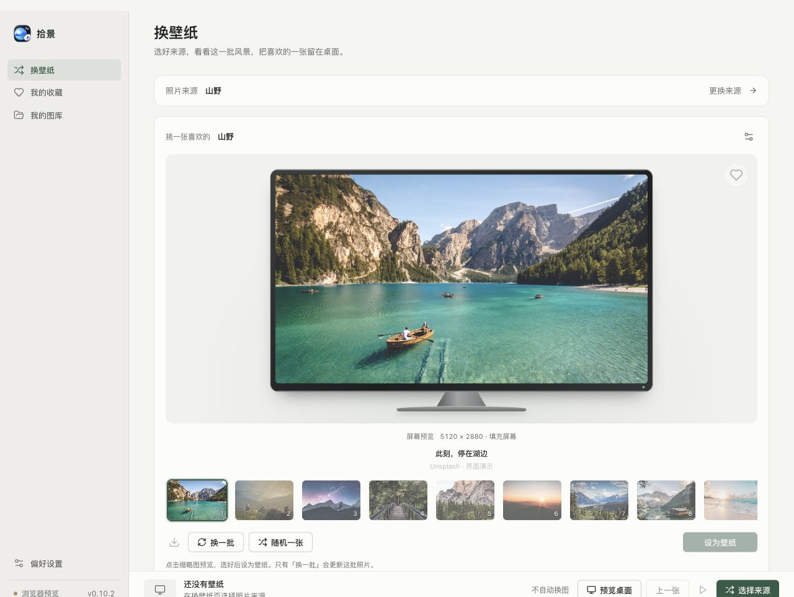
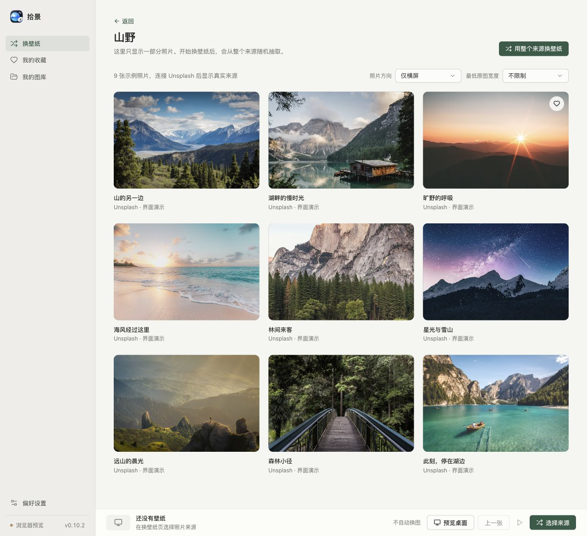
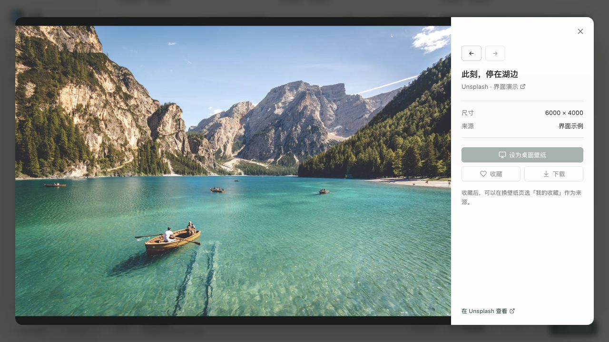
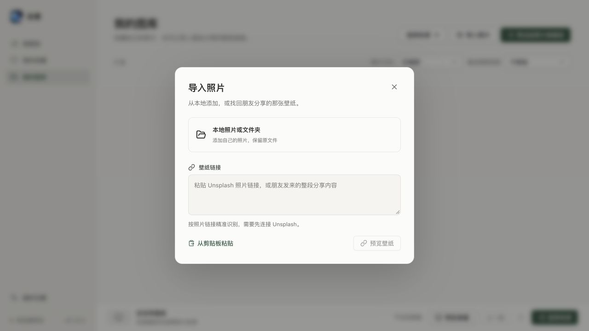
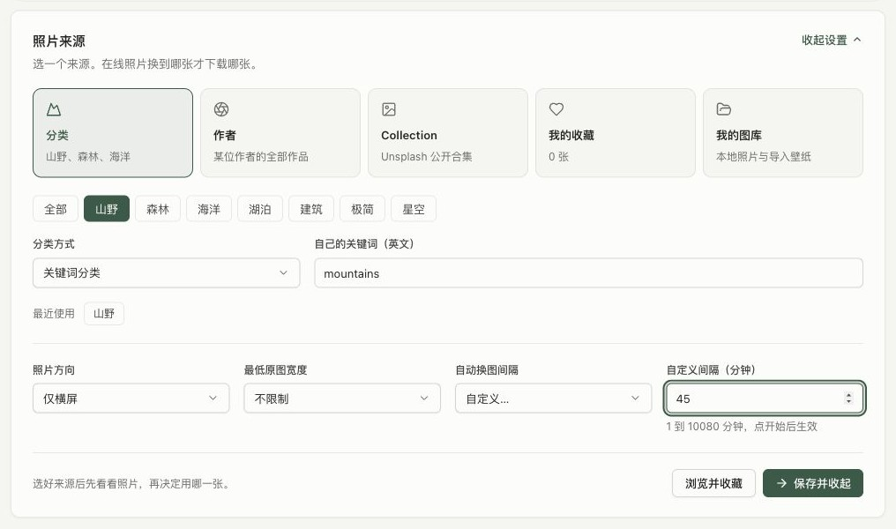
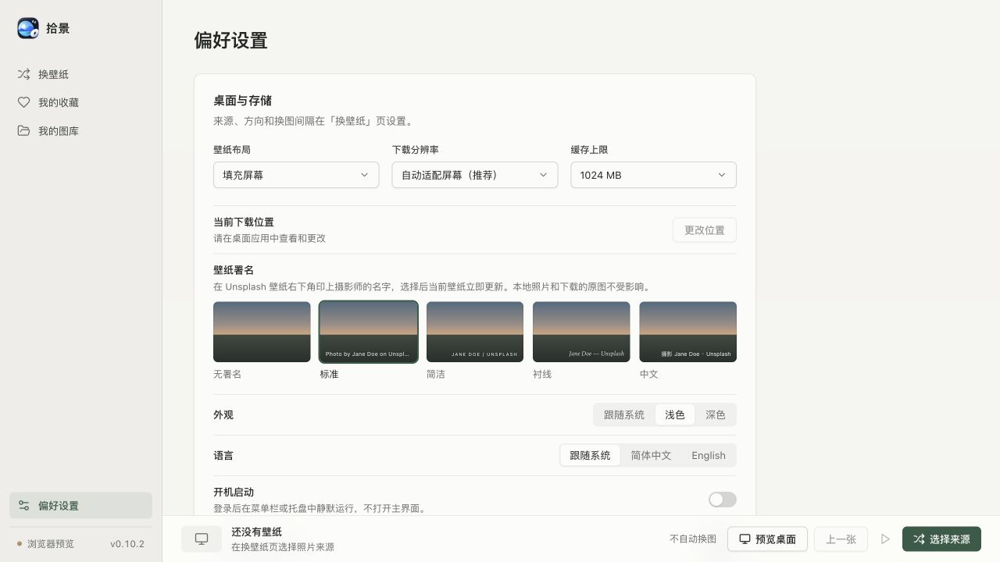
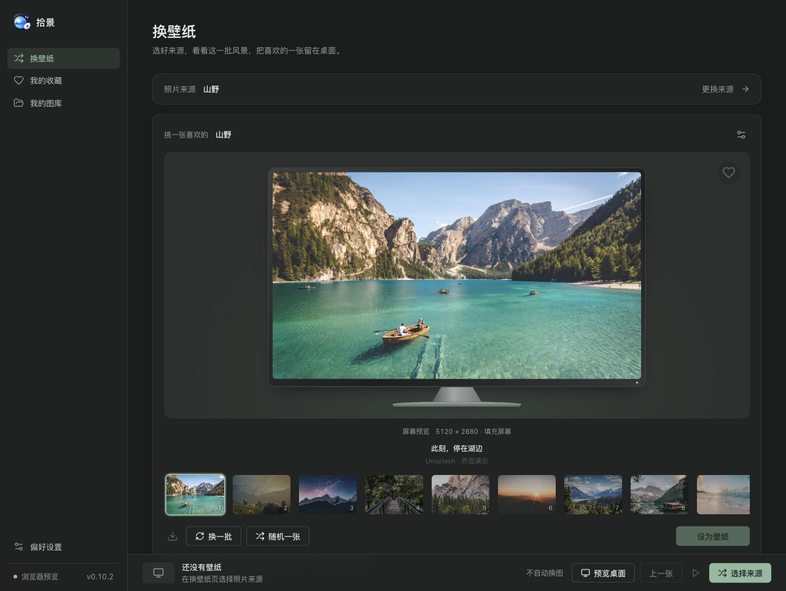

# 拾景 · Scenelet

**把喜欢的风景，留在每天打开的桌面上。**

拾景是一款简洁的摄影壁纸客户端。你可以随机欣赏一位摄影师的作品、一个 Unsplash 合集或某类风景，也可以用自己收藏和导入的照片轮换桌面壁纸。

选好来源和照片方向，先浏览一批候选，再把喜欢的一张设为壁纸。需要自动换图时，可以在底栏开启轮换。无需提前下载整个图库，也不用一直开着窗口。

**简体中文 / English · 跟随系统的浅色 / 深色外观 · Windows / macOS · 本地照片无需 Key**

[官网与截图](https://leoonliang.github.io/Scenelet/) · [下载安装版](https://github.com/LeoonLiang/Scenelet/releases/latest) · [所有版本](https://github.com/LeoonLiang/Scenelet/releases) · [Changelog](CHANGELOG.md) · [发布流程](docs/releases.md)



*本文截图更新于 2026-10-10，来自 v0.10.2 的浏览器预览。照片为内置 Unsplash 界面示例，示例尺寸不代表 API 返回的真实元数据；设壁纸、收藏示例照片等按钮因此禁用。真实连接、系统壁纸和后台轮换请使用桌面客户端。*

[快速开始](#快速开始) · [选图与预览](#先看一批再选一张) · [分享与导入](#分享与导入壁纸) · [常见问题](#常见问题)

## 为什么用拾景？

- **跟随喜欢的摄影师**：填入作者用户名或主页链接，从这个作者的公开作品中随机选图。
- **按你的喜好选风景**：山野、森林、海洋、建筑、极简，或自定义关键词与官方主题。
- **用自己的照片集合**：支持 Unsplash Collection、个人收藏、本地照片与文件夹。
- **挑适合屏幕的照片**：筛选横屏、竖屏、方形和最低原图宽度，避免把不同尺寸的作品一股脑拿来用。
- **先预览，再应用**：最多 12 张候选，按屏幕比例预览；主页与菜单栏 / 托盘选图面板同步。
- **按自己的节奏换图**：预设间隔、自定义分钟数，或「不自动换」；随时暂停、继续、回到上一张。
- **喜欢就分享**：复制 Unsplash 壁纸链接，对方预览确认后导入「我的图库」。
- **照顾桌面细节**：自动适配屏幕清晰度、可选摄影师署名；Windows 可同步锁屏，开机后静默留在托盘。
- **按需下载**：只下载选中的壁纸，优先避开近期 20 张；缓存上限可设置，清理时保留当前壁纸。
- **出错也看得懂**：临时网络故障自动重试，失败时显示步骤和具体原因，保留原壁纸。

## 下载与运行

在 [GitHub Releases](https://github.com/LeoonLiang/Scenelet/releases) 选择最新正式版本。推荐安装版：Windows 下载对应架构的 `setup.exe`，Mac 下载 Intel 或 Apple Silicon 的 `installer.dmg`。ZIP 为免安装 / 归档选择。

每个版本独立一个 Release，附件名称包含系统、架构和安装方式。草稿与预发布版本不进入自动更新。官网根据已发布的实际附件推荐下载，不猜测不存在的安装包。

Windows 安装版运行安装程序即可；Mac DMG 打开后将 App 拖入 Applications。Windows 便携版：

1. 将 ZIP **完整解压**到一个固定文件夹。
2. 在解压后的文件夹中运行 **`Scenelet.exe`**。
3. 按下面的步骤使用本地照片，或连接 Unsplash 后选择在线来源。

便携版无需安装 Node.js。请保留 EXE 同目录的运行时文件，不要只复制 EXE 或直接从压缩包中运行。当前构建未做代码签名。

| 平台 | 当前状态 |
| --- | --- |
| Windows | x64 / ARM64 安装版与便携版；x64 桌面壁纸已验证，ARM64 尚待实机验证 |
| macOS | Intel / Apple Silicon，DMG 与 ZIP；通过 Actions 构建，壁纸及权限仍待实机验证 |
| 浏览器 | 界面预览，可临时导入照片；不提供真实壁纸设置、API 连接或后台轮换 |

## 快速开始

### 用电脑里的照片：无需 Key

1. 进入 **「我的图库 → 导入照片」**，点击 **「本地照片或文件夹」**；首次打开时也可从首页点击「先用本地照片」。
2. 选择导入照片或文件夹。支持 JPG、JPEG、PNG、WebP、BMP；文件夹导入读取当前文件夹中的照片，不递归子文件夹。
3. 回到「换壁纸」页，在照片来源中选「我的图库」，设置照片方向、最低宽度和换图间隔。
4. 点击 **「保存并收起」**，在候选缩略图中选中喜欢的照片，再点击 **「设为壁纸」**。想自动轮换，在底栏点击继续按钮；也可在图库页面点击「用这些照片换壁纸」。

导入只建立照片索引及小尺寸预览，不移动或修改原图。导入在独立进程中处理并显示进度，大图库只渲染当前可见区域。导入后请保留原文件的位置。

「我的图库」可「重新扫描」已导入的文件夹，发现新照片和失效路径。预览中可「重新定位文件」，也可「从图库移除」；移除不删除原图，重新扫描不会重新加入，手动导入可恢复。轮换会跳过已丢失的本地文件。

### 用 Unsplash 的照片

在线模式需要自己的 **Unsplash Access Key**，不是 Secret Key。已有应用的 Key 可在 [Unsplash 开发者页面](https://unsplash.com/developers) 中查找；API 用途限制见下方 [Unsplash 使用说明](#unsplash-使用说明)。

1. 在首页「连接 Unsplash」中粘贴 Key，点击 **「连接并保存」**。
2. 在「照片来源」中选择 **分类、作者或 Collection**，填写相应内容。
3. 设置照片方向、最低原图宽度和换图间隔。
4. 点击 **「保存并收起」**。来源选项会收起并显示一批候选，选中喜欢的照片后点击 **「设为壁纸」**。在底栏点击继续按钮，可按所选间隔自动换图。

Key 会加密保存在本机，下次启动自动恢复。输入框默认遮盖，点击眼睛可查看；也可以修改或移除。

**不用先浏览、收藏或加载全部照片。**「浏览并收藏」是可选步骤，在线随机取图的范围始终是所选来源的公开照片池。

### 该选哪种来源？

| 想看什么 | 选择 | 填写 / 操作示例 |
| --- | --- | --- |
| 山野、森林、海洋等风景 | 分类 | 点击分类按钮，或输入 `forest`、`ocean` 等关键词 |
| Unsplash 官方策展主题 | 分类 → 官方主题 | 输入 `nature` 或 `https://unsplash.com/t/nature` |
| 某位摄影师的全部公开作品 | 作者 | `anniespratt`、`@anniespratt` 或 `https://unsplash.com/@anniespratt` |
| Unsplash 网站上的公开照片合集 | Collection | 粘贴 `https://unsplash.com/collections/合集ID/…`，也可仅填合集 ID |
| 自己一张张挑选的照片 | 我的收藏 | 浏览照片时点爱心，再用收藏集合换壁纸 |
| 电脑里的照片 | 我的图库 | 导入照片 / 文件夹，无需连接 Unsplash |
| 不限定类别的公开照片 | 分类 → 全部 | 直接开始随机换图 |

“作者”使用作者的公开作品；“Collection”使用网站上那个合集里的照片；“我的收藏”是保存在拾景本机的个人精选集合。

## 先看一批，再选一张

首页确认来源后会收起来源选项，只保留一行摘要，显示最多 12 张候选照片；编辑时也能随时点击「收起设置」，候选面板始终保留。主页会按主显示器的真实宽高比例绘制一台屏幕，在里面模拟当前照片及壁纸布局；横屏、超宽屏、竖屏都会自适应，窗口缩小时模型也会缩小。下方缩略图可直接切换；点击 **「设为壁纸」** 才应用这张照片。菜单栏仍使用紧凑大图预览。macOS 的壁纸布局由系统管理，主页以填充效果示意。

- **换一批**：从同一来源随机抽一批候选，优先避开最近展示过的照片；小来源会在照片不足时复用旧图。
- **随机一张**：在当前候选中随机选中一张预览，不更换整批，也不立即修改桌面。
- **更换来源**：重新展开来源和筛选设置。

左键点击菜单栏 / 系统托盘图标，打开紧凑选图面板。关闭再打开会保留这一批和选中项；主页与菜单栏的候选和选中项同步。更换来源或筛选会重新加载，移除的本地照片会从候选中剔除。右键仍可打开主窗口、直接随机更换壁纸、暂停 / 继续或退出。

## 浏览、收藏与预览

点击 **「浏览并收藏」**，可以按当前方向和宽度筛选分页浏览。点照片打开大图，点爱心加入「我的收藏」。



想只轮换自己挑选的照片？回首页选择 **「我的收藏」**，点击「保存并收起」，选中照片后设为壁纸；需要自动轮换时在底栏继续换图。也可在收藏页面点击「用这些照片换壁纸」。

预览中可以单独设置当前照片为桌面壁纸、收藏或下载。左右方向键切换照片，Tab 在弹窗内移动，Esc 关闭；加载失败可重新加载或打开详情修复路径。桌面版支持按主屏幕比例预览当前填充布局，实际效果可能因系统而异。偏好设置中的「自动适配屏幕」按所有屏幕的实际像素选择下载清晰度，也可手动指定。Unsplash 照片设为壁纸时默认在右下角印上摄影师署名，可在「偏好设置 → 壁纸署名」选择样式（标准、简洁、衬线、中文，不随界面语言变化）或「无署名」，当前壁纸会立即按新样式更新；本地照片和下载的原图不受影响。单独设一张壁纸不会更改已配置的自动轮换来源；想持续使用这个来源，请点击「用整个来源换壁纸」。

<details>
<summary>查看大图预览界面</summary>



*示例照片用于展示界面；连接真实来源或导入本地照片后，桌面版相应操作可用。*

</details>

## 分享与导入壁纸

在当前壁纸或大图预览中点击 **「分享」**，会复制这张 Unsplash 照片的链接和导入说明。对方打开 **「我的图库 → 导入照片」**，在「壁纸链接」中粘贴链接或整段分享内容，点击「预览壁纸」，核对照片后确认导入。导入后保留在图库中，可设置为壁纸、收藏或再次分享。重复导入同一张照片不会产生副本。链接解析需要先连接 Unsplash；本地照片与文件夹仍从同一个导入入口添加。



也可以在窗口非输入区域按 ⌘V / Ctrl+V，直接打开带有链接的导入窗口。预览和导入都不会自动更换桌面壁纸。

## 按自己的节奏换图

首页的 **「自动换图间隔」** 提供 **「不自动换」**、15 分钟、30 分钟、1 小时、3 小时、6 小时、每天和 **「自定义」**。想一直保留一张照片，选「不自动换」并保存，再点击「设为壁纸」即可。

例如填入 `45`，就是每 45 分钟换一张。自定义范围为 **1–10080 的整数分钟**，最长 7 天。更改来源、方向、最低宽度或间隔后，点击 **「保存并收起」** 生效并保存；查看候选不会立即更换桌面。自动轮换可在底栏暂停或继续。



窗口底部和托盘右键菜单都可以随机换一张、暂停或继续。窗口底部显示下一次换图时间，并可回到「上一张」；首页「最近使用」展示最近 20 张不同的照片。修改语言、清晰度或缓存等无关设置不会重置换图时间，重启后保留计划，休眠恢复后最多补换一张。默认关闭窗口后留在托盘，自动换图继续运行；从托盘选择「退出」会停止轮换。开机启动可在「偏好设置」中开启：登录后只在 macOS 菜单栏 / Windows 托盘中静默运行，不弹主窗口；手动打开应用仍显示窗口。

## 外观与桌面细节

「偏好设置」集中管理下载清晰度、缓存、下载位置、署名、外观和语言。**简体中文 / English** 覆盖界面、菜单栏、托盘与系统提示；外观可选浅色、深色或跟随系统。



- **署名留在合适的位置**：提供标准、简洁、衬线、中文与无署名。Windows 换图时按显示缩放和任务栏高度留出底部空间；本地照片和下载原图不受影响。
- **看看真实桌面**：底栏「预览桌面」暂时收起窗口，点击拾景的 Dock、任务栏或菜单栏图标回来。
- **菜单栏 / 托盘可选显示**：在偏好设置中开关。Windows 隐藏托盘图标后，关闭窗口会退出；macOS 仍可从 Dock 打开。

<details>
<summary>查看深色界面</summary>



</details>

## 常见问题

### 连不上 Unsplash，或提示连接超时？

超时、连接中断及服务端临时故障时，应用会自动追加 3 次重试，分别等待 1、2、4 秒，并显示进度。仍失败时，点击 **「查看具体错误」** 展开请求路径、错误代码或服务端原因，也可以复制详情。

若持续出现 `UND_ERR_CONNECT_TIMEOUT`，说明当前网络无法及时连接 `api.unsplash.com`。请检查网络、代理或防火墙后重试。图片下载还需要能够访问 `images.unsplash.com`；重试不能解决持续不可达的问题。

Key 无效、没有访问权限、来源不存在或配额耗尽时会直接提示原因，不盲目重试。

### 没有找到合适的照片？

先尝试降低「最低原图宽度」或改为「所有方向」，并检查作者用户名、合集链接是否正确。某些作者的作品以竖图为主，或合集里没有足够宽的照片。浏览时也可以继续加载下一批。

筛选检查原照片的真实尺寸，不会把竖图自动当成横图。没有匹配照片时会保留当前壁纸。

### 会把一个作者的所有图片下载回来吗？

不会。在线随机时只读取少量候选的尺寸等信息，再下载选中的一张。浏览图库按页加载缩略图，高清图在设为壁纸或下载时获取。

### 收藏后，是否可以完全离线轮换？

收藏保存的是照片记录，**不等于已经下载原图**。尚未缓存的在线照片仍需联网获取；想稳定离线使用，建议导入本地照片。

### 为什么只换了桌面，没有换锁屏？

Windows 可在「偏好设置 → 同步到锁屏」开启同步，新安装默认开启；旧版用户升级后可自行选择。锁屏失败会单独提示，桌面设置与轮换仍然有效。Windows 聚焦或系统策略可能影响锁屏显示；macOS 不提供锁屏同步。暂不支持多显示器分别设置、视频壁纸或云同步。

### 应用如何更新？

Windows 安装版启动后自动检查 GitHub Releases，发现稳定新版后后台下载，你确认「重启并安装」才安装。也可在「偏好设置 → 应用更新」手动检查。

Windows 便携版和当前未签名的 Mac 包也会在应用内下载对应架构的新版，显示下载进度并校验文件。Mac 下载完成后点击「退出并打开安装包」，安装包成功打开后应用保存数据并退出，再将新版拖入「应用程序」替换；Windows 便携版点击「显示下载文件」，退出后解压替换。下载失败可重新检查，或使用发行版本页面下载。Mac 暂不支持重启后自动安装。Key、收藏与设置保存在独立数据目录，正常升级会保留。

### Mac 提示 Apple 无法验证是否包含恶意软件？

当前 Mac 包未做 Developer ID 签名和 Apple 公证，因此首次打开可能被 macOS 拦截。确认安装包来自本项目的官方 Releases 后，可在「系统设置 → 隐私与安全性」中找到拾景的提示，点击「仍要打开」，按系统提示确认。升级后也可能需要再次确认。

应用内下载不会解决这个系统提示。消除这类拦截需要开发者提供 Apple Developer 证书并完成公证，当前不提供已签名或已公证的安装包。

### 照片和 Key 保存在哪里？

设置、收藏和照片索引保存在本机，Key 使用系统加密存储。Windows 数据目录为 `%APPDATA%\framewall`；更名为拾景后仍沿用这个目录，保留旧版数据。

图库每次保存会保留上一次有效数据作为 `library.json.bak`。启动读取异常时尝试从备份恢复并提示；无法恢复时保留损坏文件副本。

缓存可以在「偏好设置」中限制大小或清理，清理时保留当前壁纸。请勿把 Key、`credential.bin` 或个人数据目录上传到仓库或公开分享。

## Unsplash 使用说明

Unsplash 官方 API Guidelines 将壁纸应用列入限制用途，并限制要求用户自行注册开发者账户的公开应用。**技术上可连接不代表用途已经获得许可；个人 Key 也不等于用途授权。** 在线功能需遵守服务方规则，公开发行或推广在线模式前应与 Unsplash 确认许可。本地照片模式不依赖 Unsplash API。

应用使用官方 API，不抓取网页。在线随机范围是接口可访问的公开照片池，不包括私人照片，也不保证每一张作品都会被抽到。关键词分类与官方主题是不同来源。

[查看官方 API Guidelines](https://help.unsplash.com/en/articles/2511245-unsplash-api-guidelines) · [API 文档](https://unsplash.com/documentation)

## 开发与反馈

技术栈：**Electron + React + TypeScript + Vite**，无需自行部署服务器。

需要 Node.js 22.12+，在项目根目录执行：

```sh
npm install
npm run dev
```

构建与测试：

```sh
npm run build
npm test
npm start
```

仅预览界面：`npm run dev:web`；预览官网：`node scripts/serve-site.cjs`，打开 `http://127.0.0.1:4174`。本地打包：`npm run release:build -- win32 x64`。Mac 需在 Mac 上构建。Windows PowerShell 如遇脚本执行策略限制，可将 `npm` 换成 `npm.cmd`。

自动化测试覆盖来源筛选、随机选图、Key 加密、超时重试、自定义间隔、更新版本比较、安装包下载与校验，以及网站安装包选择。真实账户在线取图、跨版本的实际安装更新、macOS 壁纸权限与 ARM64 实机仍待验证。

反馈问题时请附上系统版本、应用版本、操作步骤，以及「复制错误详情」中的内容；不要附带 Key。欢迎提供界面与使用体验的建议。

更多资料：[发布与更新](docs/releases.md) · [开发与验证](docs/development.md) · [技术架构](docs/architecture.md) · [产品范围](docs/product.md)
